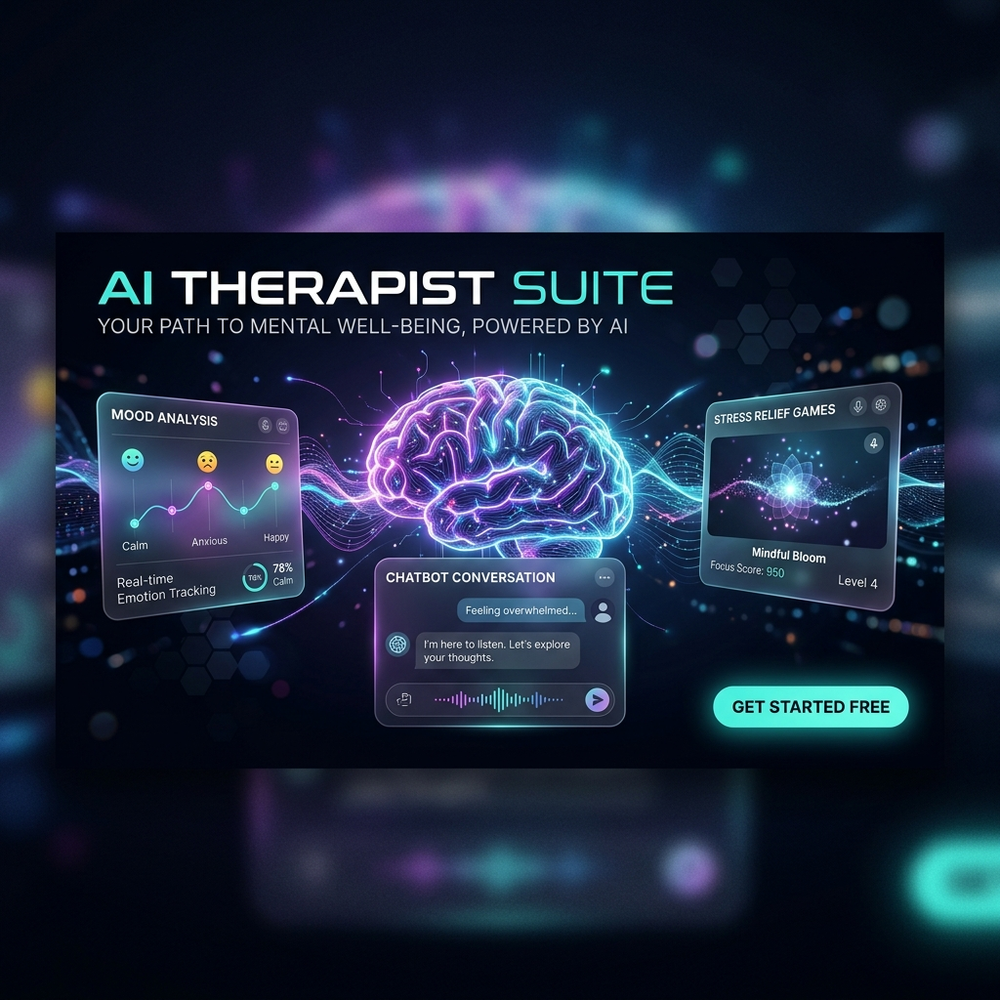
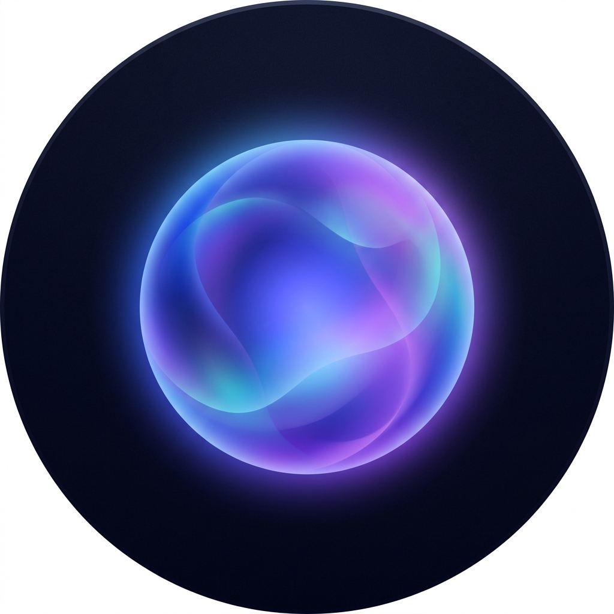
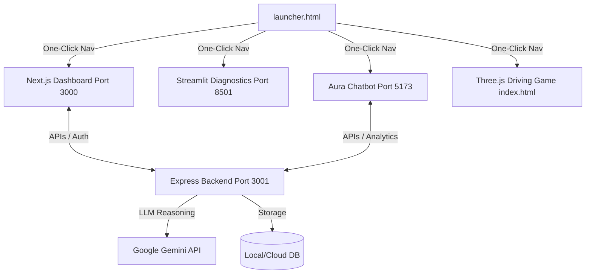

# 🌟 AI Therapist & Wellness Suite 🌟

<p align="center">
  
</p>

<p align="center">
  
</p>

<p align="center">
  <strong>An integrated multi-app digital mental wellness ecosystem powered by AI.</strong>
</p>

<p align="center">
  
  
  
  
  
  
</p>

---

## 📖 Table of Contents
1. [Overview](#-overview)
2. [Ecosystem Apps](#-ecosystem-apps)
3. [Architecture Overview](#-architecture-overview)
4. [Getting Started & Installation](#-getting-started--installation)
5. [Port Mappings](#-port-mappings)
6. [Repository Structure](#-repository-structure)
7. [Screenshots & Assets](#-screenshots--assets)

---

## 🧠 Overview

The **AI Therapist & Wellness Suite** is a unified therapeutic platform offering users various avenues for emotional tracking, counseling, psychiatric diagnostics, interactive companionship, and stress relief. The suite connects frontend user interfaces, backend analytical servers, and visual game engines.

---

## 🚀 Ecosystem Apps

The workspace is composed of several independent projects:

### 1. 🎨 AI Therapist Dashboard (Next.js & Express)
*   **Location**: [ai-therapist-agent-main](file:///d:/D/ai%20therepist/ai-therapist-agent-main) (Frontend) & [ai-therapist-agent-backend-main](file:///d:/D/ai%20therepist/ai-therapist-agent-backend-main) (Backend)
*   **Features**:
    *   Dynamic emotional health check-in/mood tracker.
    *   Virtual session scheduler & history logging.
    *   Relaxation mini-games (Breathing exercises, Flappy Bird, Zen Garden, Ocean Waves, Forest environment).
    *   Paimon visual companion widget.

### 2. 💬 Aura Chatbot (Vite & React)
*   **Location**: [google-chatbot (2)](file:///d:/D/ai%20therepist/google-chatbot%20(2))
*   **Features**:
    *   Real-time conversation with emotional support agents powered by Gemini AI.
    *   Sentiment tracking over conversation logs.
    *   Clean, minimalist dashboard interfaces.

### 3. 📊 MindPulse AI (Streamlit)
*   **Location**: [MindPulse-AI-main](file:///d:/D/ai%20therepist/MindPulse-AI-main)
*   **Features**:
    *   Interactive diagnostic tools for mental health.
    *   Data visualizations on historical wellness indicators.
    *   Personalized health insights based on mood statistics.

### 4. 🎮 Stress-Relief Three.js Driving Game (WebGL)
*   **Location**: [index.html](file:///d:/D/ai%20therepist/index.html)
*   **Features**:
    *   A relaxing, retro-styled 3D driving game built with Three.js.
    *   Fluid controls, mobile support, sunset lighting environments, and collision detection.

### 5. 🤖 Paimon Therapist Companion (Static Web)
*   **Location**: [paimon-therapist](file:///d:/D/ai%20therepist/paimon-therapist)
*   **Features**:
    *   A static, lightweight interactive widget with visual dialogs and customizable assets.

---

## 🏗️ Architecture Overview



---

## ⚙️ Getting Started & Installation

### Prerequisite Check
Ensure you have the following installed on your machine:
*   [Node.js](https://nodejs.org/) (v18 or higher recommended)
*   [Python 3.10+](https://www.python.org/)
*   Git

### Quick Start (One-Click Launcher)
We have configured a one-click batch launcher to start all components together:

1. Double-click [start-integrated-app.bat](file:///d:/D/ai%20therepist/start-integrated-app.bat) in the root directory.
2. The script will automatically:
    *   Clear previous services running on target ports.
    *   Spin up the Next.js Frontend, Express Backend, Streamlit analytics, and Aura Vite Chatbot.
3. Open [launcher.html](file:///d:/D/ai%20therepist/launcher.html) to navigate between apps seamlessly.

---

## 🔌 Port Mappings

| Service | Port / URL | Description |
| :--- | :--- | :--- |
| **Launcher Portal** | [launcher.html](file:///d:/D/ai%20therepist/launcher.html) | Portal landing page. |
| **Main Dashboard** | `http://localhost:3000` | Next.js Frontend. |
| **Backend Express API** | `http://localhost:3001` | Core AI reasoning and endpoints. |
| **Aura AI Chatbot** | `http://localhost:5173` | React emotional support assistant. |
| **MindPulse AI** | `http://localhost:8501` | Streamlit diagnostic analyzer. |
| **Stress Relief Game** | [index.html](file:///d:/D/ai%20therepist/index.html) | Local WebGL 3D Driving Game. |

---

## 📂 Repository Structure

```
ai-therapist/
├── assets/                          # Generated graphics & logos
│   ├── therapist_suite_banner.png
│   └── aura_logo.png
├── ai-therapist-agent-main/         # Next.js Frontend code
├── ai-therapist-agent-backend-main/ # Express backend API and agent config
├── google-chatbot (2)/              # Aura Vite/React app
├── MindPulse-AI-main/               # Python mental health analyzer
├── paimon-therapist/                # Interactive static widget
├── index.html                       # Three.js 3D driving stress relief
├── launcher.html                    # Visual multi-app portal launcher
└── start-integrated-app.bat         # Automated orchestration script
```

---

*Made with 💖 for mental wellness and open source diagnostics.*
